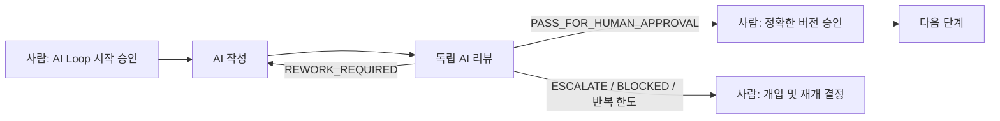

# AI-DLC

**AI가 작성하고, 다른 AI가 독립적으로 리뷰하며, 사람은 검증된 결과를 승인하는 소프트웨어 개발 생명주기입니다.**

AI-DLC는 Codex Plugin 기반의 멀티 에이전트 워크플로입니다. 사용자의 아이디어를 요구사항, 아키텍처, 구현 계획, 코드와 검증 증거로 단계적으로 발전시키면서 모든 결정과 산출물의 추적성을 유지합니다.

단순히 코드를 빠르게 생성하는 것이 목적은 아닙니다. 모호한 요청이 바로 구현으로 넘어가거나, 작성 에이전트가 자신의 결과를 스스로 승인하거나, 사람의 통제 없이 자동 반복되는 문제를 방지하는 것이 핵심입니다.

## 핵심 워크플로

요구사항, 아키텍처, 구현 계획과 같은 문서 단계에는 동일한 **AI Author-Review Loop**가 적용됩니다.



1. 사람이 특정 단계와 버전의 AI 루프 시작을 승인합니다.
2. 작성 에이전트가 버전이 부여된 산출물을 만듭니다.
3. 작성자와 분리된 리뷰 에이전트가 같은 버전을 독립적으로 검토합니다.
4. 수정 가능한 문제가 있으면 허용된 반복 횟수 안에서 `AI 작성 → AI 리뷰`를 반복합니다.
5. AI 리뷰가 `PASS_FOR_HUMAN_APPROVAL`을 권고한 경우에만 사람 승인 단계로 이동합니다.
6. 사람이 리뷰를 통과한 정확한 버전을 승인해야 baseline이 확정되고 다음 단계로 진행합니다.

AI 리뷰 통과는 사람의 승인을 대신하지 않습니다. 에이전트는 권고만 하며, 승인과 상태 전환 권한은 항상 사람에게 있습니다.

## 전체 개발 흐름

```text
프로젝트 인테이크
  → 요구사항 작성 ↔ 요구사항 AI 리뷰 → 사람 승인
  → 아키텍처 작성 ↔ 아키텍처 AI 리뷰 → 사람 승인
  → 구현 계획 작성 ↔ 구현 계획 AI 리뷰 → 사람 승인
  → 작업 패킷 단위 구현
  → 독립 코드 리뷰
  → 테스트 및 검증
  → 사람이 결과 수락 또는 재작업 결정
```

각 구현 작업은 승인된 요구사항, 아키텍처와 구현 계획을 입력으로 사용합니다. 변경 범위와 허용 경로, 수용 기준, 검증 명령, 롤백 경계가 명시된 작은 작업 패킷 단위로 수행합니다.

## 주요 원칙

- **Human in control:** 모든 phase 시작, baseline 확정, 범위 변경과 고위험 동작은 사람이 승인합니다.
- **Independent review:** 작성과 리뷰는 서로 다른 에이전트 invocation 또는 subagent가 수행합니다.
- **Bounded iteration:** AI 재작업은 승인된 범위와 반복 한도 안에서만 진행됩니다.
- **Immutable artifacts:** 리뷰가 시작된 산출물은 덮어쓰지 않고 새 버전으로 수정합니다.
- **Document first:** 승인된 문서가 다음 단계의 기준 입력이 됩니다.
- **End-to-end traceability:** 목표, 요구사항, ADR, 작업 패킷, 코드 변경, 리뷰와 테스트 증거를 연결합니다.
- **Evidence-based decisions:** diff, 빌드, 정적 분석, 보안 검사와 테스트 결과를 근거로 판정합니다.
- **Least authority:** 각 에이전트는 승인된 작업에 필요한 최소 컨텍스트와 권한만 받습니다.

## 포함된 에이전트

| Skill | 역할 |
|---|---|
| `ai-dlc-orchestrator` | 상태, 승인 게이트, 산출물 버전과 에이전트 라우팅 조정 |
| `draft-requirements` | 기능·비기능 요구사항, 품질 속성, 수용 기준과 추적성 작성 |
| `review-requirements` | 요구사항의 완전성, 명확성, 테스트 가능성과 범위 독립 검토 |
| `design-architecture` | 승인된 요구사항을 기반으로 아키텍처, 인터페이스와 ADR 작성 |
| `review-architecture` | 품질 속성, 경계, 보안, 운영성과 기술 선택 독립 검토 |
| `plan-implementation` | 작업 패킷, 의존성, 검증, 배포와 롤백 계획 작성 |
| `review-implementation-plan` | 구현 계획의 추적성, 실행 가능성, 범위와 검증 가능성 독립 검토 |
| `implement-change` | 승인된 작업 패킷 하나를 지정된 범위 안에서 구현 |
| `review-code` | 구현 결과의 정확성, 보안, 유지보수성과 범위 준수 독립 검토 |
| `verify-change` | 승인된 검증 매트릭스를 실행하고 재현 가능한 증거 생성 |

## 산출물과 상태

AI-DLC를 적용한 프로젝트의 워크플로 상태와 산출물은 `.ai-dlc/`에 Markdown과 YAML로 저장합니다.

```text
.ai-dlc/
  registry.yaml
  projects/
    <project-id>/
      project.yaml
      state.yaml
      approvals.yaml
      findings.yaml
      traceability.yaml
      requirements/
      architecture/
      implementation/
      runs/
```

한 저장소에서 여러 소프트웨어를 진행할 수 있으며 각 프로젝트의 상태와 산출물은 `.ai-dlc/projects/<project-id>/` 아래에 격리됩니다. `registry.yaml`은 프로젝트 목록과 선택적인 `active_project_id`만 관리합니다. 여러 프로젝트가 있고 요청에 프로젝트가 명시되지 않았다면 AI-DLC는 임의 선택하지 않고 사용자에게 프로젝트 선택을 요청합니다.

기존 `.ai-dlc/state.yaml` 기반 저장소는 레거시 단일 프로젝트로 계속 읽을 수 있습니다. 프로젝트 네임스페이스로 이동하는 작업은 별도 사람 승인 없이는 수행하지 않습니다.

이 구조는 다음 정보를 Git diff로 검토하고 감사할 수 있게 합니다.

- 누가 어떤 버전과 행동을 승인했는지
- 산출물을 누가 작성하고 독립 리뷰했는지
- 어떤 finding이 발견되고 어떻게 처리됐는지
- 요구사항이 어떤 설계, 구현과 테스트 증거로 이어지는지
- 실패가 요구사항, 아키텍처, 계획, 구현, 테스트 또는 환경 중 어디에서 발생했는지

## 시작하기

이 저장소를 로컬 Codex Plugin으로 등록한 뒤, 프로젝트에서 AI-DLC 오케스트레이터에게 워크플로 시작을 요청합니다.

예시 요청:

```text
이 프로젝트에서 승인 게이트가 적용된 AI-DLC 워크플로를 시작해줘.
```

여러 프로젝트를 사용하는 저장소에서는 프로젝트 ID를 포함합니다.

```text
PROJECT stock-portfolio-forecast
APPROVE REQUIREMENTS AI LOOP v001
```

오케스트레이터는 곧바로 파일을 만들거나 전문 에이전트를 실행하지 않습니다. 먼저 현재 상태, 생성할 산출물과 정확한 승인 문구를 제시하고 사람의 승인을 기다립니다.

> 이 저장소는 현재 초기 버전입니다. 플러그인에 전체 역할별 skill과 계약이 포함되어 있지만, 시스템 명세의 상태는 `PROPOSED`이며 실제 프로젝트 적용 시 각 승인 게이트와 산출물을 검토해야 합니다.

## 저장소 구조

```text
.codex-plugin/plugin.json   # Codex Plugin manifest
skills/                     # 오케스트레이터와 역할별 agent skills
docs/system-specification.md # 전체 요구사항, 워크플로와 아키텍처 명세
```

자세한 상태 머신, 승인 문구, 수용 기준, 리스크 정책과 아키텍처 결정은 [시스템 명세](docs/system-specification.md)를 참고하세요.

## 현재 안전 경계

AI-DLC는 다음 동작을 사람 승인 없이 수행하지 않는 것을 기본 원칙으로 합니다.

- 운영 환경 배포 또는 데이터 삭제·마이그레이션
- 보호 브랜치, 인프라 또는 고위험 설정 변경
- 승인된 범위 밖의 파일과 기술 스택 변경
- AI 판단만으로 이루어지는 baseline 또는 최종 승인
- 작성 에이전트가 자신의 산출물을 최종 검증하는 흐름

## 라이선스

현재 저장소에 별도 라이선스가 명시되어 있지 않습니다.
