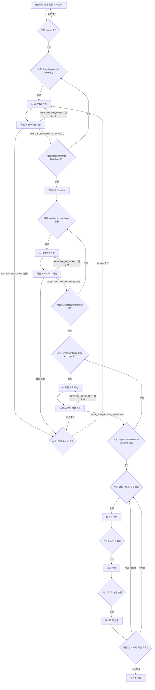
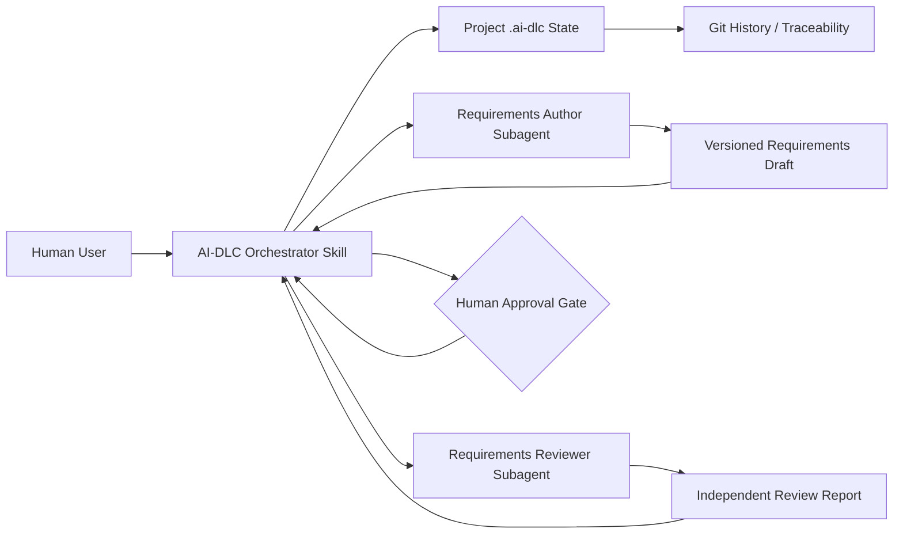

# AI-DLC 시스템 명세서

- 문서 ID: `AI-DLC-SPEC-001`
- 버전: `0.1.0`
- 상태: `PROPOSED`
- 작성일: `2026-07-14`
- 대상 프로젝트: `ai-dlc`
- 기준 구현: Codex Plugin 기반 AI-DLC 워크플로

---

## 1. 문서 목적

본 문서는 LLM 에이전트를 활용하여 요구사항 정의, 아키텍처 설계, 설계 검토, 구현 계획, 구현, 코드 리뷰와 검증을 수행하는 AI 기반 소프트웨어 개발 생명주기인 **AI-DLC**의 시스템 요구사항과 아키텍처 원칙을 정의한다.

AI-DLC는 단순한 코드 생성 도구가 아니다. 시스템의 목적은 다음을 만족하는 통제 가능한 소프트웨어 개발 프로세스를 제공하는 것이다.

- 소프트웨어 목적을 추적 가능한 명세로 변환한다.
- 서로 다른 전문 역할의 LLM 에이전트가 산출물을 작성하고 독립적으로 검토한다.
- 요구사항부터 테스트 증거까지 모든 산출물을 연결한다.
- 한 번에 하나의 작은 구현 태스크를 수행하고 즉시 검증한다.
- 모든 단계 전환과 모든 재작업 iteration에 사람 승인을 요구한다.
- LLM의 제안과 실제 승인·상태 변경 권한을 분리한다.

---

## 2. 배경과 해결할 문제

LLM 기반 코딩 도구의 활용이 증가하면서 구현 속도는 빨라졌지만 다음 문제가 커지고 있다.

1. 불완전하거나 모호한 요청이 곧바로 코드로 변환된다.
2. 요구사항, 설계, 코드와 테스트가 서로 연결되지 않는다.
3. 기술 선택과 trade-off의 근거가 기록되지 않는다.
4. 구현 에이전트가 자신의 결과를 스스로 검증한다.
5. 실패 원인을 구분하지 않고 동일한 구현 수정만 반복한다.
6. LLM의 자동 반복이 비용, 시간, 변경 범위를 초과할 수 있다.
7. 승인되지 않은 범위나 기술이 구현에 유입될 수 있다.

AI-DLC는 문서화된 산출물 계약, 역할 분리, 독립 검토, 명시적 상태 머신과 사람 승인 게이트를 통해 이 문제를 해결한다.

---

## 3. 제품 비전과 목표

### 3.1 제품 비전

사용자가 만들고자 하는 소프트웨어의 목적, 사용자, 기능과 제약을 입력하면 AI-DLC가 다음 결과를 단계적으로 생성한다.

1. 기능 및 비기능 요구사항
2. NFR에 포함된 품질 측정값과 FR 검증 조건
3. 시스템 아키텍처와 Architecture Decision Record(ADR)
4. ATAM 기반 아키텍처 리스크 분석
5. 작고 독립적으로 검증할 수 있는 구현 태스크 계획
6. 태스크 단위 코드 변경과 테스트
7. 독립 코드 리뷰와 요구사항 검증 결과
8. 목표부터 검증 증거까지의 추적성 정보

각 단계는 사람의 명시적 승인 없이는 실행되거나 다음 단계로 전환될 수 없다.

### 3.2 목표

- 사용자 아이디어를 간결하고 검증 가능한 요구사항으로 변환한다.
- 요구사항에 근거한 아키텍처와 독립적으로 실행 가능한 작업 패킷을 만든다.
- 독립 리뷰와 검증 증거로 구현 전후의 주요 리스크를 발견한다.
- 모든 단계와 iteration에서 사람의 통제권과 감사 가능한 이력을 보장한다.

### 3.3 성공 지표

| 지표 | 목표 |
|---|---:|
| Must FR의 인라인 검증 조건 보유 비율 | 100% |
| 승인된 NFR의 측정 가능 또는 명시적 미결정 상태 비율 | 100% |
| 승인된 제약사항의 근거 보유 비율 | 100% |
| FR·NFR·제약사항의 5~7개 정책 준수 또는 예외 근거 비율 | 100% |
| 아키텍처 결정과 구현 패킷의 관련 요구사항 직접 참조 비율 | 100% |
| 완료 태스크의 리뷰 및 테스트 증거 보유 비율 | 100% |
| 사람 승인 없이 수행된 단계 전환 | 0건 |
| 사람 승인 없이 수행된 재작업 iteration | 0건 |
| 승인 없이 보호 브랜치 또는 운영 환경을 변경한 실행 | 0건 |

---

## 4. 범위

### 4.1 전체 제품 범위

- 프로젝트 목적, 사용자, 범위와 제약 수집
- 기능 및 비기능 요구사항 작성
- 요구사항 모호성, 충돌, 누락과 검증 가능성 검토
- NFR 안에 품질 운영 조건과 측정 목표 작성
- 시스템 아키텍처와 ADR 작성
- ATAM 기반 sensitivity, trade-off와 리스크 분석
- 리스크 severity 및 처리 방향 제안
- 구현 계획과 태스크 의존성 DAG 생성
- 격리 환경에서 태스크 단위 코드 구현
- 빌드, 정적 분석, 보안 검사와 테스트
- 독립 코드 리뷰 및 요구사항 검증
- 실패 원인에 따른 요구사항·설계·계획·구현 재작업
- 산출물 버전, 직접 참조, 승인 및 감사 기록 관리

### 4.2 버전 0.1 범위

현재 버전은 요구사항 단계의 vertical slice를 구현한다.

- AI-DLC 오케스트레이터
- 요구사항 작성 에이전트
- 요구사항 독립 리뷰 에이전트
- 요구사항 상태 머신
- 모든 과정의 사람 승인 게이트
- 요구사항 산출물, 리뷰, finding, 승인과 baseline 관리

아키텍처, ATAM, 계획, 구현과 코드 검증 에이전트는 이후 버전에서 동일한 계약 구조로 추가한다.

### 4.3 제외 범위

- 운영 환경에 대한 완전 자율 배포
- 사람 승인 없는 데이터 삭제 또는 마이그레이션
- 사람 승인 없는 인프라·보호 브랜치 변경
- 고위험 도메인의 전문 규제 준수 자동 판정
- 자연어 에이전트 판정만으로 이루어지는 최종 승인
- 단일 에이전트가 작성과 최종 검증을 동시에 수행하는 흐름

---

## 5. 사용자와 역할

| 역할 | 책임 |
|---|---|
| Product Owner | 프로젝트 목적, 범위, 우선순위, 검증 조건과 요구사항 baseline을 승인한다. |
| Architect | 아키텍처와 ADR을 검토하고 주요 trade-off를 승인한다. |
| Developer | 구현 태스크와 코드 변경을 검토하고 필요한 경우 직접 수정한다. |
| Reviewer/QA | 독립 리뷰, 테스트 결과와 추적성을 확인한다. |
| Risk Owner | Critical/High 리스크의 수용 또는 반려를 결정한다. |
| Platform Administrator | 모델, 에이전트, 도구 권한, 비용과 실행 정책을 관리한다. |
| Auditor | 산출물 생성, 승인, 도구 실행과 상태 전환 이력을 조회한다. |

한 사용자가 여러 역할을 수행할 수 있으나, 작성 에이전트와 리뷰 에이전트는 서로 다른 invocation 또는 subagent여야 한다.

---

## 6. 핵심 원칙과 불변식

### 6.1 핵심 원칙

1. **문서 우선:** 승인된 산출물이 후속 에이전트의 기준 입력이다.
2. **사람 승인 우선:** 에이전트는 권고만 하며 사람만 승인한다.
3. **역할 분리:** 작성자와 독립 리뷰어를 분리한다.
4. **최소 컨텍스트:** 각 에이전트는 역할 수행에 필요한 승인된 정보만 받는다.
5. **작은 변경:** 한 번에 하나의 작고 검증 가능한 태스크를 수행한다.
6. **불변 버전:** 검토가 시작된 산출물은 덮어쓰지 않고 새 버전을 생성한다.
7. **증거 기반 판정:** 테스트 로그, diff, 정적 분석 결과 등 실행 증거를 사용한다.
8. **제한된 반복:** 재작업마다 사람 승인을 받고 반복 한도를 적용한다.

### 6.2 시스템 불변식

- `INV-001`: 사람 승인 없이 전문 에이전트를 호출할 수 없다.
- `INV-002`: 사람 승인 없이 단계 결과를 수락할 수 없다.
- `INV-003`: 사람 승인 없이 다음 단계로 전환할 수 없다.
- `INV-004`: 사람 승인 없이 재작업 iteration을 시작할 수 없다.
- `INV-005`: 에이전트 권고는 사람 승인으로 기록할 수 없다.
- `INV-006`: 하나의 승인은 하나의 checkpoint와 하나의 artifact version에만 적용된다.
- `INV-007`: 승인된 산출물이 변경되면 해당 승인과 후속 산출물은 stale 처리된다.
- `INV-008`: 구현 에이전트는 자신의 결과를 최종 승인할 수 없다.
- `INV-009`: blocking finding이 존재하면 baseline 또는 다음 단계로 진행할 수 없다.
- `INV-010`: 상태 기록에 실패한 실행은 전환 완료로 보고할 수 없다.

---

## 7. 에이전트 구성

### 7.1 오케스트레이터

오케스트레이터는 AI-DLC 상태를 읽고 현재 checkpoint에서 허용된 하나의 행동만 조정한다.

책임:

- 프로젝트 상태와 artifact version 확인
- 다음 작업에 필요한 사람 승인 요청
- 전문 에이전트에 승인된 input packet 전달
- 산출물 존재 및 계약 준수 확인
- 결과 요약과 다음 승인 선택지 제시
- 승인, 반려, pause와 transition 기록
- finding의 원인에 따른 재작업 단계 결정

금지:

- 사람 승인을 추론하거나 재사용
- 전문 산출물을 대신 작성하고 동시에 승인
- 여러 단계를 하나의 승인으로 연속 실행
- 승인 전 파일, 상태 또는 baseline 생성

### 7.2 요구사항 작성 에이전트

입력:

- 승인된 project brief
- 승인된 범위와 제약
- 작성 대상 version
- 해당 작성 또는 재작업 invocation의 사람 승인 ID
- 재작업인 경우 수락된 finding과 사람 의견

출력:

- 목적, 성공 기준, 사용자와 범위의 짧은 설명
- 인라인 검증 조건을 포함한 기능 요구사항 `FR-*`
- 운영 조건과 측정 목표를 포함한 비기능 요구사항 `NFR-*`
- 근거가 있는 제약사항 `CON-*`
- 필요한 최소한의 가정, 미결정 질문과 revision summary

FR, NFR과 제약사항은 각각 5~7개가 기본이다. 범위를 벗어나면 통합할 수 없는 구체적인 근거를 기록하고, 별도 `QA-*`, `AC-*` 또는 요구사항 추적표를 생성하지 않는다.

요구사항 작성 에이전트는 기술 선택을 요구사항으로 임의 확정할 수 없다.

### 7.3 요구사항 리뷰 에이전트

요구사항 작성 invocation과 분리된 독립 에이전트로 동작한다.

검토 항목:

- authorization과 artifact identity
- 완전성 및 source fidelity
- 명확성, atomicity와 일관성
- 테스트 가능성
- FR 인라인 검증 가능성
- NFR 측정 가능성과 제약사항 근거
- 항목 수 정책, 중복과 불필요한 섹션
- 범위 일탈 및 숨은 기술 결정
- 인증, 권한, 개인정보, 장애와 데이터 lifecycle 리스크

출력 recommendation:

- `PASS_FOR_HUMAN_APPROVAL`
- `REWORK_REQUIRED`
- `ESCALATE_TO_HUMAN`
- `BLOCKED`

어떤 recommendation도 사람 승인을 대신하지 않는다.

### 7.4 향후 에이전트

| 에이전트 | 주요 산출물 |
|---|---|
| Architecture Agent | 시스템 구조, 인터페이스, 배포 구조, ADR |
| ATAM Review Agent | utility tree, sensitivity, trade-off, risk와 완화안 |
| Implementation Planning Agent | 태스크 DAG, 변경 범위, 완료 정의와 테스트 계획 |
| Implementation Agent | 태스크 범위 코드 변경과 단위 테스트 |
| Code Review Agent | correctness, security, performance와 설계 준수 finding |
| Verification Agent | 빌드·테스트 evidence와 작업 패킷 완료 조건 판정 |

Security, SRE, Data, UX/Accessibility와 Compliance 에이전트는 프로젝트 위험 프로필에 따라 선택적으로 호출한다.

---

## 8. 전체 워크플로



### 8.1 사람 승인 정책

모든 승인 요청은 다음 정보를 표시해야 한다.

1. 방금 완료된 행동과 산출물
2. 대상 artifact path와 version
3. 변경 내용과 열린 finding
4. 다음에 실행할 단일 행동
5. 생성 또는 수정될 파일과 외부 side effect
6. 예상 비용 또는 실행 범위
7. 정확한 승인 문구
8. 대안: 수정, 반려, pause 또는 중단

승인은 자연어라도 checkpoint, action과 version이 명확해야 한다. 침묵, 이전 단계의 일반 동의, "좋다" 또는 "계속"만으로 승인했다고 판단하지 않는다.

### 8.2 요구사항 단계 상태

| 현재 상태 | 필요한 사람 결정 | 허용 행동 | 다음 상태 |
|---|---|---|---|
| `NOT_INITIALIZED` | `APPROVE INTAKE` | 프로젝트 상태 초기화 | `AWAITING_REQUIREMENTS_LOOP_AUTHORIZATION` |
| `AWAITING_REQUIREMENTS_LOOP_AUTHORIZATION` | `APPROVE REQUIREMENTS AI LOOP vNNN` | 제한된 author-review loop 시작 | `REQUIREMENTS_AI_LOOP` |
| `REQUIREMENTS_AI_LOOP` | 없음: 승인된 loop 내부 자동 routing | AI 작성, 독립 AI 리뷰, 한도 내 재작성 | pass 시 human approval, 중단 조건 시 human intervention |
| `AWAITING_REQUIREMENTS_HUMAN_APPROVAL` | `APPROVE REQUIREMENTS BASELINE vNNN` 또는 반려 | exact reviewed version baseline 확정 또는 새 loop 준비 | architecture loop authorization 또는 requirements loop authorization |
| `AWAITING_HUMAN_INTERVENTION` | scope/input/limit/stop 결정 | 중단 원인 해소 및 named loop 재승인 | 해당 loop authorization |

모든 상태는 사람의 pause, 입력 누락, 독립성 위반, state corruption 또는 policy conflict로 `PAUSED`나 `BLOCKED`가 될 수 있다.

### 8.3 문서별 AI Author-Review Loop

요구사항, 아키텍처와 구현 계획은 사람이 각 문서 phase의 loop 시작을 승인한 뒤 동일한 bounded AI author-review 정책을 적용한다.

| 문서 phase | Loop 시작 승인 | 작성 에이전트 | 독립 리뷰 에이전트 | AI pass 이후 사람 승인 |
|---|---|---|---|---|
| Requirements | `APPROVE REQUIREMENTS AI LOOP vNNN` | `$draft-requirements` | `$review-requirements` | `APPROVE REQUIREMENTS BASELINE vNNN` |
| Architecture | `APPROVE ARCHITECTURE AI LOOP vNNN` | `$design-architecture` | `$review-architecture` | `APPROVE ARCHITECTURE BASELINE vNNN` |
| Implementation Plan | `APPROVE IMPLEMENTATION PLAN AI LOOP vNNN` | `$plan-implementation` | `$review-implementation-plan` | `APPROVE IMPLEMENTATION PLAN BASELINE vNNN` |

각 loop는 다음 순서를 따른다.

1. 작성 에이전트가 승인된 input baseline과 scope로 versioned artifact를 생성한다.
2. 작성자와 다른 invocation의 독립 리뷰 에이전트가 같은 version을 검토한다.
3. 리뷰가 `REWORK_REQUIRED`이고 finding이 artifact 수정으로 해결 가능하며 iteration capacity가 남아 있으면, 오케스트레이터는 finding을 다음 version 작성 입력으로 자동 routing한다.
4. 리뷰가 `PASS_FOR_HUMAN_APPROVAL`이면 자동 반복을 종료하고 exact reviewed version만 사람 승인 대상으로 제시한다.
5. `ESCALATE_TO_HUMAN`, `BLOCKED`, scope 또는 baseline 변경 필요, 모호한 finding, 반복 한도 도달 시 loop를 중단하고 사람 결정을 요청한다.

### 8.4 Implementation Plan AI Loop

Implementation Plan loop는 사람 승인된 requirements baseline과 architecture baseline을 모두 입력으로 사용해야 한다. 계획 작성자는 work packet, dependency order, 허용 및 금지 범위, completion evidence, test, migration, rollout과 rollback을 제안한다. 독립 계획 리뷰어는 다음 항목을 모두 확인한다.

- 모든 필수 baseline 항목이 관련 work packet에서 직접 참조되고 verification evidence를 갖는지
- 각 work packet이 독립적으로 승인·구현·검토 가능한 크기인지
- dependency와 migration 순서가 안전하며 누락이나 순환이 없는지
- allowed/prohibited scope와 완료 조건이 명확한지
- test, compatibility, rollout과 rollback 전략이 실제로 검증 가능한지
- 구현 전에 사람 또는 authoritative source가 결정해야 할 항목이 공개되어 있는지

Implementation Plan 리뷰가 `PASS_FOR_HUMAN_APPROVAL`을 반환하더라도 계획은 승인된 것이 아니다. 사람이 exact reviewed version에 대해 `APPROVE IMPLEMENTATION PLAN BASELINE vNNN`을 제공한 이후에만 work-packet 구현 승인 단계로 전환할 수 있다.

---

## 9. 산출물과 이력

### 9.1 프로젝트 파일 구조

AI-DLC가 대상 소프트웨어 프로젝트에서 관리할 기본 구조는 다음과 같다.

```text
.ai-dlc/
  registry.yaml
  projects/
    <project-id>/
      project.yaml
      state.yaml
      approvals.yaml
      findings.yaml
      requirements/
        drafts/requirements-v001.md
        reviews/review-v001.md
        baseline.md
      architecture/
        drafts/architecture-v001.md
        reviews/architecture-review-v001.md
        baseline.md
      implementation/
        plans/implementation-plan-v001.md
        plan-reviews/implementation-plan-review-v001.md
        executions/WP-001-v001.md
        reviews/WP-001-review-v001.md
        verifications/WP-001-verification-v001.md
      runs/
        run-YYYYMMDD-NNN.md
```

`registry.yaml`은 저장소 범위의 프로젝트 레지스트리이며 나머지 파일은 모두 프로젝트 범위다. 프로젝트 ID는 `[a-z0-9][a-z0-9-]{0,62}`를 만족하는 고유하고 불변인 slug다. 오케스트레이터는 명시된 프로젝트 ID를 우선하고, 없으면 모호하지 않은 `active_project_id`만 사용한다. 둘 다 사용할 수 없으면 사용자 선택 전까지 `BLOCKED`다.

기존 최상위 `.ai-dlc/state.yaml` 구조는 레거시 단일 프로젝트로 인식한다. 레지스트리 생성과 `.ai-dlc/projects/<project-id>/` 이동은 별도 사람 승인과 경로 검증, 롤백 계획 없이 자동 수행하지 않는다.

이 구조는 플러그인 자체의 `skills/` 구조와 다르다. 플러그인은 workflow 정의를 제공하고, `.ai-dlc/`는 workflow가 적용되는 대상 프로젝트의 상태와 산출물을 저장한다.

### 9.2 Artifact 공통 메타데이터

모든 주요 artifact는 다음을 포함해야 한다.

- artifact ID와 type
- version과 status
- project ID
- 작성 role 또는 agent invocation
- 승인된 input artifact reference
- 생성 timestamp
- superseded version
- 승인 여부와 approval ID
- 관련 finding 및 필요한 직접 참조

### 9.3 직접 참조 원칙

별도 요구사항 추적표는 관리하지 않는다. 아키텍처 결정은 관련 `FR-*`, `NFR-*`, `CON-*`를 직접 참조하고, 작업 패킷은 관련 요구사항과 아키텍처 결정을 직접 참조한다. 코드 리뷰와 검증 보고서는 해당 작업 패킷을 기준으로 evidence를 남긴다. 동일 관계를 여러 표에 반복하지 않는다.

### 9.4 Version 정책

- 리뷰가 시작된 artifact는 immutable이다.
- 수정은 새 version으로 생성한다.
- 의미가 같은 요구사항은 revision에서도 ID를 유지한다.
- 다른 의미로 ID를 재사용하지 않는다.
- 변경된 baseline은 후속 artifact를 `STALE` 또는 `REVERIFY_REQUIRED`로 만든다.

---

## 10. 핵심 기능 요구사항

기능 요구사항은 시스템 수준의 핵심 책임 7개로 통합한다. 세부 동작과 검증 조건은 각 FR 안에서 설명하며 별도 AC 항목을 만들지 않는다.

| ID | 요구사항 | 검증 조건 |
|---|---|---|
| FR-001 | 시스템은 프로젝트 목적, 사용자, 범위와 제약을 등록하고 프로젝트별 workflow 상태를 격리해 관리해야 한다. | 여러 프로젝트가 존재할 때 명시된 프로젝트만 읽고 쓰며, 모호하면 사용자 선택 전까지 실행하지 않는다. |
| FR-002 | 시스템은 문서 단계 시작, baseline 확정, 범위 변경과 작업 패킷 실행 전에 해당 대상과 버전을 명시한 사람 승인을 요구해야 한다. | 승인 없는 agent 호출·상태 전환·artifact 생성은 0건이어야 하며 AI recommendation은 승인으로 기록되지 않는다. |
| FR-003 | 시스템은 requirements, architecture와 implementation plan에 bounded author-review loop를 적용해야 한다. | 작성자와 리뷰어가 분리되고, pass·rework·escalation·반복 한도에 따라 정의된 상태로 routing된다. |
| FR-004 | 요구사항 작성자는 `FR-*`, 품질 측정값을 포함한 `NFR-*`, `CON-*`만 관리하고 각 범주를 기본 5~7개로 유지해야 한다. | 별도 `QA-*`, `AC-*`, 요구사항 추적표가 없으며 범위 밖 개수에는 구체적인 근거가 있다. |
| FR-005 | 시스템은 승인된 요구사항을 핵심 아키텍처 결정과 독립적으로 실행 가능한 작업 패킷으로 발전시켜야 한다. | 관련 요구사항은 결정과 패킷에서 직접 참조되고 중복 추적표 없이 coverage를 검토할 수 있다. |
| FR-006 | 각 작업 패킷은 승인된 범위 안에서 구현되고 독립 코드 리뷰와 재현 가능한 검증을 거쳐야 한다. | 변경 경로, 완료 조건, 검증 명령, 결과 evidence와 rollback 경계가 기록된다. |
| FR-007 | 시스템은 모든 승인, 반려, artifact version, finding, invocation과 상태 전환을 감사 가능한 이력으로 보존해야 한다. | 특정 baseline 또는 작업 패킷의 입력, 작성자, 리뷰어, disposition과 검증 결과를 조회할 수 있다. |

---

## 11. 비기능 요구사항과 품질 측정값

품질 속성 시나리오의 필요한 정보는 NFR의 운영 조건과 측정 목표에 직접 포함한다.

| ID | 속성 | 운영 조건과 측정 가능한 요구사항 |
|---|---|---|
| NFR-001 | 승인 무결성 | 모든 workflow 상태에서 승인되지 않은 단계 실행, baseline 확정과 범위 확대는 0건이어야 한다. |
| NFR-002 | 독립성 | 모든 author-review iteration에서 작성자와 리뷰어 invocation이 달라야 하며 독립성을 확인할 수 없는 review report는 0건이어야 한다. |
| NFR-003 | 복구와 반복 제한 | 중단 후 마지막 일관된 human gate에서 재개할 수 있어야 하며 승인된 최대 횟수를 초과한 자동 iteration은 0건이어야 한다. |
| NFR-004 | 보안과 격리 | agent와 tool은 승인 범위의 최소 권한만 사용하고 secret 평문 기록, 프로젝트 간 쓰기와 승인되지 않은 외부 전송은 0건이어야 한다. |
| NFR-005 | 감사와 재현성 | 모든 주요 artifact와 상태 변경은 input version, role, timestamp와 evidence를 포함해 재현 가능해야 한다. |
| NFR-006 | 사용성과 간결성 | 각 사람 gate는 한 화면에서 결정할 수 있게 요약하고, 문서에는 빈 섹션·중복 표·형식 채우기용 항목이 없어야 한다. |
| NFR-007 | 상호운용성과 유지보수성 | 핵심 artifact는 사람이 읽을 수 있는 Markdown/YAML을 사용하고 skill, contract, template와 프로젝트 artifact를 독립적으로 version 관리해야 한다. |

---

### 11.1 제약사항

| ID | 제약사항 | 근거 |
|---|---|---|
| CON-001 | 현재 구현은 Codex Plugin과 repository-local Markdown/YAML artifact를 사용한다. | 초기 제품 범위 |
| CON-002 | 문서 단계의 AI author-review loop 기본 최대 반복 횟수는 3회다. | 비용 및 무한 반복 통제 |
| CON-003 | AI는 baseline 승인, 위험 수용, 범위 확대, merge, push, deploy 또는 release를 대신 결정할 수 없다. | 사람 통제 원칙 |
| CON-004 | 리뷰가 시작된 artifact는 수정하지 않고 새 version으로 보존한다. | 감사 및 검토 무결성 |
| CON-005 | 요구사항보다 상세한 기술 선택은 승인된 제약이거나 후속 architecture decision이어야 한다. | 단계 책임 분리 |
| CON-006 | 작업 패킷 구현, 코드 리뷰와 검증은 서로 다른 invocation으로 수행한다. | 독립 검증 원칙 |
| CON-007 | release readiness와 운영 배포는 현재 plugin completion 범위 밖이다. | 현재 버전 범위 |

---

## 12. 논리 아키텍처

### 12.1 현재 버전

현재 AI-DLC는 별도 Python 서비스나 데이터베이스 없이 Codex Plugin으로 구현한다.



구성 요소:

| 구성 요소 | 책임 |
|---|---|
| Plugin manifest | AI-DLC plugin identity와 포함 skill 선언 |
| Orchestrator skill | state machine, approval gate, delegation과 transition 규칙 |
| Author skill | 승인된 input에서 requirements proposal 생성 |
| Reviewer skill | 승인된 draft의 독립 검토 및 recommendation |
| Skill references | workflow contract, requirement contract와 review policy |
| Skill assets | state, requirements와 review artifact template |
| Target `.ai-dlc/` | 프로젝트별 state, approval, finding와 artifact 저장 |
| Git | 변경 이력과 사람이 검토 가능한 diff 제공 |

### 12.2 향후 확장

조직 규모, 동시 실행과 외부 시스템 연동이 필요해지면 다음을 추가할 수 있다.

- MCP server: GitHub, issue tracker, CI, artifact storage 연동
- lifecycle hook: 승인 token, file scope와 policy의 기계적 검증
- durable workflow service: 장기 실행, 동시성, transaction과 resume 관리
- 필요 시 여러 repository와 project 간 영향 분석 서비스
- execution sandbox: code generation, build와 test 격리

이러한 확장은 현재 skill contract를 대체하지 않고 기계적으로 강화해야 한다.

---

## 13. 주요 아키텍처 결정

### ADR-001: 초기 구현은 Codex Plugin과 Skill을 사용한다

- 상태: Accepted
- 결정: 별도 application server 대신 plugin, skill, reference와 template로 요구사항 vertical slice를 구현한다.
- 근거: 핵심 문제는 UI나 database보다 agent workflow와 artifact contract 검증이다.
- 장점: 빠른 iteration, 낮은 운영 복잡도, repository 중심 version 관리
- 단점: 강한 transaction, 동시 실행, 중앙 dashboard와 조직 audit가 제한된다.
- 재검토 조건: 다중 사용자 동시 실행, 외부 approval system, exactly-once execution 또는 중앙 reporting이 필요할 때

### ADR-002: 문서 단계는 사람 승인 범위 안에서 AI author-review loop를 수행한다

- 상태: Accepted
- 결정: 문서 phase 시작과 baseline 확정에는 별도의 사람 승인을 요구한다. phase 시작 승인에는 최대 3회의 `AI 작성 -> 독립 AI 리뷰 -> AI 재작성`이 포함되며, correctable finding은 추가 사람 승인 없이 loop 내부에서 routing한다.
- 근거: 시스템의 주목적은 완전 자율 개발보다 통제 가능한 AI-DLC이다.
- 장점: 사람에게 검토를 요청하기 전에 기본 품질 gate를 통과시키면서 범위와 반복 비용을 제한한다.
- 단점: 한 phase 안의 AI 호출 비용과 latency가 증가하고 reviewer 품질에 의존한다.
- 재검토 조건: 기본 반복 한도, reviewer pass 기준 또는 human-intervention 조건을 조직 policy에 맞게 조정할 때. baseline과 고위험 side effect 승인은 유지한다.

### ADR-003: 작성과 검토를 분리한다

- 상태: Accepted
- 결정: author와 reviewer는 서로 다른 subagent 또는 invocation을 사용한다.
- 근거: 동일한 context와 가정에서 발생하는 자기검증 편향을 줄인다.
- 단점: 비용과 latency가 증가한다.
- 재검토 조건: 독립 검토가 비용 대비 품질 개선을 제공하지 않는다는 평가 결과가 반복적으로 확인될 때

### ADR-004: Artifact는 Markdown/YAML과 immutable version으로 관리한다

- 상태: Accepted
- 결정: 사람이 읽고 Git diff로 검토할 수 있는 Markdown/YAML을 사용하며 review 이후 overwrite하지 않는다.
- 근거: 투명성, portability, auditability와 초기 구현 단순성
- 단점: 대규모 graph query와 strict schema enforcement는 제한된다.
- 재검토 조건: artifact volume과 조직 간 query가 file 기반 관리 한도를 초과할 때

### ADR-005: Agent는 recommendation만 반환한다

- 상태: Accepted
- 결정: agent output status는 proposal 또는 recommendation이며 승인 권한을 갖지 않는다.
- 근거: LLM의 비결정적 판단과 실제 workflow 권한을 분리한다.
- 재검토 조건: 없음. 제품 핵심 안전 원칙으로 유지한다.

---

## 14. 리스크와 Severity

| Severity | 기준 | 기본 처리 |
|---|---|---|
| Critical | 승인 무결성 훼손, 데이터 손실, 인증 우회, 비밀 노출, 운영 중단, 핵심 목표 달성 불가 | 즉시 중단, 사람 disposition 필수 |
| High | Must 기능 누락, 심각한 NFR 미충족, 광범위 회귀나 주요 재설계 가능성 | 재작업, 예외 진행은 명시적 위험 수용 필요 |
| Medium | 제한적 품질 저하 또는 우회 가능한 결함 | 사람 결정에 따라 재작업 또는 owner가 있는 defer |
| Low | 국소적 명확성, 유지보수성과 경미한 개선 | backlog 허용 가능 |

모든 finding은 severity와 별도로 confidence를 기록한다. Low-confidence Critical/High finding은 무시하지 않고 사람 또는 전문 agent에게 재검토를 요청한다.

### 14.1 Requirements Gate

`PASS_FOR_HUMAN_APPROVAL` recommendation 조건:

- Critical finding 0개
- High finding 0개
- Must FR 인라인 검증 조건 coverage 100%
- NFR measurable-or-explicitly-blocked coverage 100%
- 제약사항 source coverage 100%
- FR, NFR과 제약사항 개수 정책 준수 또는 예외 근거 100%
- 모든 review dimension 평가 완료
- deferred Medium finding에 owner와 disposition 존재

이 조건을 만족해도 최종 baseline은 사람 승인 전까지 생성할 수 없다.

---

## 15. Iteration 정책

### 15.1 원인 기반 routing

| 원인 | 예 | 돌아갈 단계 |
|---|---|---|
| `REQUIREMENT_DEFECT` | 모호한 FR 인라인 검증 조건 | 요구사항 |
| `ARCHITECTURE_DEFECT` | 품질 목표를 만족할 구조 부재 | 아키텍처 |
| `PLAN_DEFECT` | 태스크 과대 또는 dependency 누락 | 구현 계획 |
| `IMPLEMENTATION_DEFECT` | logic 또는 error handling 결함 | 구현 |
| `TEST_DEFECT` | 잘못된 fixture 또는 assertion | 검증 또는 계획 |
| `ENVIRONMENT_DEFECT` | build image, permission, external dependency 문제 | platform 또는 blocked |
| `POLICY_VIOLATION` | 승인 없는 write, 범위 밖 file 변경 | 즉시 중단 및 escalation |

### 15.2 반복 규칙

- 사람의 phase-loop 시작 승인은 최대 3회의 author-review iteration을 허용한다.
- requirements, architecture와 implementation-plan loop의 기본 한도는 각각 3회이다.
- 각 iteration은 versioned author artifact 1개와 동일 version에 대한 독립 AI review 1개로 구성한다.
- `REWORK_REQUIRED`가 correctable artifact finding이고 capacity가 남아 있을 때만 다음 revision을 자동 시작한다.
- 동일 finding이 반복되면 recurrence를 기록한다.
- `PASS_FOR_HUMAN_APPROVAL`이면 자동 반복을 종료하고 exact reviewed version을 사람 승인에 제출한다.
- `ESCALATE_TO_HUMAN`, `BLOCKED`, 모호한 finding 또는 한도 도달 시 자동 실행을 중단한다.
- 사람은 scope 변경, 추가 입력, iteration 한도 연장, 새 loop 승인 또는 중단을 결정한다.
- 새로운 baseline이 생성되면 영향받는 후속 artifact를 다시 검증한다.

무제한 자율 반복은 허용하지 않는다. 자동화는 사람이 승인한 phase, input baseline, scope와 iteration limit 내부에서만 수행한다.

---

## 16. 보안 및 안전

### 16.1 현재 버전

- 승인 전 file/directory 생성 금지
- review precondition 실패 시 blocked report file도 생성 금지
- author와 reviewer independence 요구
- 승인된 input packet만 specialist에게 전달
- approved artifact overwrite 금지
- secret 또는 개인정보를 artifact에 포함하지 않도록 지침 적용
- external source와 repository content를 untrusted input으로 취급

### 16.2 향후 코드 실행 단계

- ephemeral sandbox 사용
- network deny-by-default와 domain allowlist
- task-scoped writable path
- CPU, memory, disk와 execution time 제한
- host socket 및 privileged container 금지
- 운영 credential 미제공
- dependency, license, vulnerability와 secret scan
- destructive command와 external side effect에 별도 사람 승인

---

## 17. 오류 및 예외 처리

| 상황 | 처리 |
|---|---|
| State file 없음 | initialization proposal을 제시하고 `APPROVE INTAKE` 대기 |
| Approval 누락 또는 version 불일치 | `BLOCKED`, file 변경 없음 |
| Author/reviewer independence 확인 실패 | `BLOCKED`, review report 생성 없음 |
| Artifact contract 위반 | 결과 수락 금지, 사람에게 defect 보고 |
| Blocking finding 존재 | baseline 및 다음 단계 금지 |
| 상태 write 실패 | transition 미완료로 보고하고 이전 state 유지 |
| 반복 한도 도달 | `BLOCKED`, 사람의 scope/limit/stop 결정 요청 |
| 상충하는 authoritative input | 임의 선택 금지, 사람 escalation |
| 승인 후 artifact 변경 | 기존 승인 무효화, 새 version과 승인 요구 |

---

## 18. 시스템 검증 원칙

별도 `AC-*` 항목은 관리하지 않는다. 제10장의 각 FR에 포함된 검증 조건과 제11장의 NFR 측정값을 다음 방식으로 확인한다.

- 승인 게이트 검증은 승인 없는 agent 호출, 상태 전환과 artifact 생성이 모두 차단되는지 확인한다.
- 독립 리뷰 검증은 author와 reviewer invocation이 다르고 pass 전에는 baseline 승인을 요청하지 않는지 확인한다.
- 반복 및 version 검증은 한도 초과 시 사람에게 escalation하고 리뷰된 artifact를 덮어쓰지 않는지 확인한다.
- 요구사항 간결성 검증은 FR, NFR과 제약사항 개수, 예외 근거, 금지된 QA/AC/추적표 부재를 확인한다.
- 구현 검증은 승인된 technology profile, 작업 패킷 범위, 완료 조건과 재현 가능한 evidence를 확인한다.
- 감사 검증은 baseline과 작업 패킷별 input, author, reviewer, finding disposition과 사람 승인을 조회할 수 있는지 확인한다.

---

## 19. 현재 구현 대응표

| 명세 요소 | 현재 구현 위치 |
|---|---|
| Plugin identity | `.codex-plugin/plugin.json` |
| Orchestration 및 사람 gate | `skills/ai-dlc-orchestrator/SKILL.md` |
| Requirements state machine | `skills/ai-dlc-orchestrator/references/workflow-contract.md` |
| State 초기 template | `skills/ai-dlc-orchestrator/assets/state-template.yaml` |
| Requirements author | `skills/draft-requirements/SKILL.md` |
| Requirements contract | `skills/draft-requirements/references/requirements-contract.md` |
| Requirements template | `skills/draft-requirements/assets/requirements-template.md` |
| Independent reviewer | `skills/review-requirements/SKILL.md` |
| Review policy와 gate | `skills/review-requirements/references/review-policy.md` |
| Review report template | `skills/review-requirements/assets/review-template.md` |
| Architecture author/reviewer | `skills/design-architecture/`, `skills/review-architecture/` |
| Implementation planner/reviewer | `skills/plan-implementation/`, `skills/review-implementation-plan/` |
| Implementation/code review/verification | `skills/implement-change/`, `skills/review-code/`, `skills/verify-change/` |

현재 구현은 요구사항, 아키텍처와 구현계획의 bounded AI author-review loop 및 작업 패킷 구현·코드 리뷰·검증 흐름을 제공한다.

---

## 20. 단계적 구현 계획

### Phase 1: Requirements Vertical Slice

- 현재 3개 skill 안정화
- 실제 프로젝트에서 intake부터 baseline까지 forward-test
- approval, state와 artifact format 정제
- representative evaluation case 구축

### Phase 2: Architecture 및 ATAM

- Architecture Agent skill
- ADR template과 decision point contract
- ATAM Review Agent skill
- severity와 risk disposition gate

### Phase 3: Planning

- task decomposition skill
- task DAG와 Definition of Ready
- file scope, dependency와 test plan contract

### Phase 4: Implementation 및 Verification

- task-scoped implementation agent
- independent code review와 verification agent
- sandbox, build/test evidence와 failure routing

### Phase 5: 조직 운영

- MCP를 통한 GitHub/CI/issue tracker 연동
- hook 기반 approval 및 file policy enforcement
- 중앙 audit와 cost dashboard
- 다중 프로젝트 및 조직 정책

---

## 21. 미결정 사항

| ID | 질문 | 영향 |
|---|---|---|
| OPEN-001 | 승인 사용자 identity를 Codex session 수준으로 기록할지 외부 identity system과 연동할지 | 감사 및 조직 운영 |
| OPEN-002 | approval phrase를 자연어로 허용할 범위와 strict token 정책은 무엇인지 | 사용성과 승인 무결성 |
| OPEN-003 | requirements revision 기본 한도 3회를 조직별로 변경할 수 있는지 | 비용과 workflow 유연성 |
| OPEN-004 | 첫 architecture 표현 형식으로 C4, arc42 또는 자체 template 중 무엇을 사용할지 | architecture agent contract |
| OPEN-005 | ATAM risk score 계산에 사용할 likelihood/impact matrix는 무엇인지 | risk gate consistency |
| OPEN-006 | 코드 실행 단계의 첫 SCM, CI와 sandbox 환경은 무엇인지 | Phase 4 구현 |
| OPEN-007 | 승인 및 artifact를 Git commit과 어떤 시점에 연결할지 | audit와 rollback |
| OPEN-008 | plugin을 personal marketplace에 설치할지 repository-local workflow로 유지할지 | 배포 및 업데이트 |

---

## 22. 변경 관리

- 본 문서는 AI-DLC 시스템의 요구사항 baseline 후보이다.
- 변경 시 version을 증가시키고 변경 이유, 영향 requirement와 승인자를 기록한다.
- agent skill, reference 또는 template 변경이 본 명세의 invariant, FR 검증 조건 또는 NFR 측정값에 영향을 주면 명세를 함께 갱신한다.
- 본 문서가 사람에게 승인되기 전까지 상태는 `PROPOSED`이다.
- 승인 이후 문서 상단 상태를 `HUMAN_APPROVED`로 변경하고 approval ID를 추가한다.

---

## 23. 승인 기록

현재 승인 상태: `PENDING`

| Approval ID | Version | Decision | Actor | Timestamp | Note |
|---|---|---|---|---|---|
| - | `0.1.0` | `PENDING` | - | - | Initial system specification proposal |
