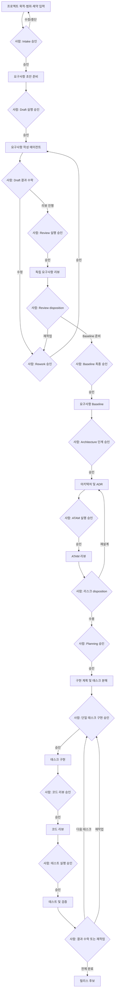
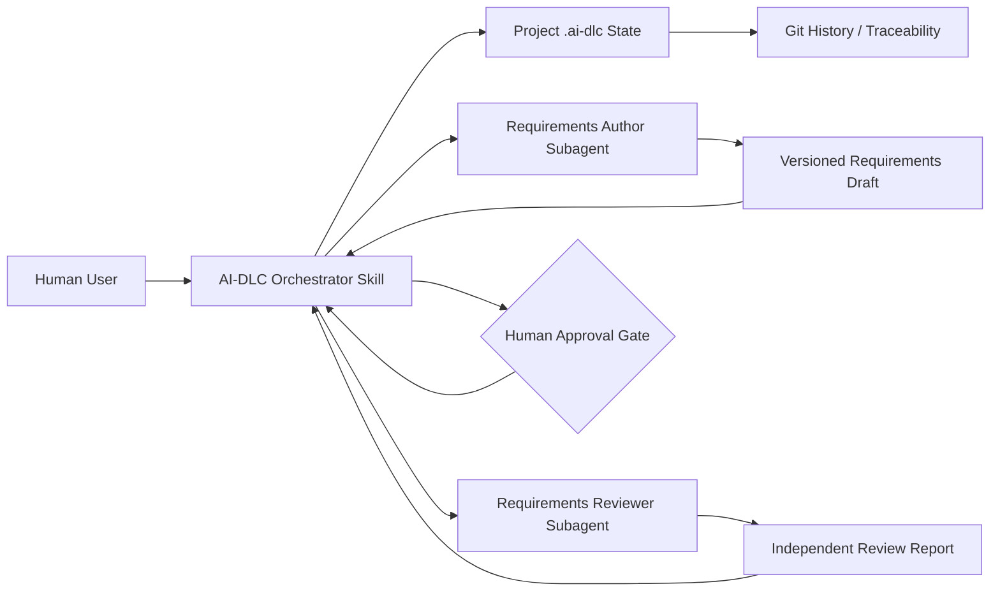

# AI-DLC 시스템 명세서

- 문서 ID: `AI-DLC-SPEC-001`
- 버전: `0.1.0`
- 상태: `PROPOSED`
- 작성일: `2026-07-14`
- 대상 프로젝트: `ai-dlc`
- 기준 구현: Codex Plugin 기반 AI-DLC 워크플로

---

## 1. 문서 목적

본 문서는 LLM 에이전트를 활용하여 요구사항 정의, 아키텍처 설계, 설계 검토, 구현 계획, 구현, 코드 리뷰와 검증을 수행하는 AI 기반 소프트웨어 개발 생명주기인 **AI-DLC**의 시스템 요구사항과 아키텍처 원칙을 정의한다.

AI-DLC는 단순한 코드 생성 도구가 아니다. 시스템의 목적은 다음을 만족하는 통제 가능한 소프트웨어 개발 프로세스를 제공하는 것이다.

- 소프트웨어 목적을 추적 가능한 명세로 변환한다.
- 서로 다른 전문 역할의 LLM 에이전트가 산출물을 작성하고 독립적으로 검토한다.
- 요구사항부터 테스트 증거까지 모든 산출물을 연결한다.
- 한 번에 하나의 작은 구현 태스크를 수행하고 즉시 검증한다.
- 모든 단계 전환과 모든 재작업 iteration에 사람 승인을 요구한다.
- LLM의 제안과 실제 승인·상태 변경 권한을 분리한다.

---

## 2. 배경과 해결할 문제

LLM 기반 코딩 도구의 활용이 증가하면서 구현 속도는 빨라졌지만 다음 문제가 커지고 있다.

1. 불완전하거나 모호한 요청이 곧바로 코드로 변환된다.
2. 요구사항, 설계, 코드와 테스트가 서로 연결되지 않는다.
3. 기술 선택과 trade-off의 근거가 기록되지 않는다.
4. 구현 에이전트가 자신의 결과를 스스로 검증한다.
5. 실패 원인을 구분하지 않고 동일한 구현 수정만 반복한다.
6. LLM의 자동 반복이 비용, 시간, 변경 범위를 초과할 수 있다.
7. 승인되지 않은 범위나 기술이 구현에 유입될 수 있다.

AI-DLC는 문서화된 산출물 계약, 역할 분리, 독립 검토, 명시적 상태 머신과 사람 승인 게이트를 통해 이 문제를 해결한다.

---

## 3. 제품 비전과 목표

### 3.1 제품 비전

사용자가 만들고자 하는 소프트웨어의 목적, 사용자, 기능과 제약을 입력하면 AI-DLC가 다음 결과를 단계적으로 생성한다.

1. 기능 및 비기능 요구사항
2. 품질 속성 시나리오와 수용 기준
3. 시스템 아키텍처와 Architecture Decision Record(ADR)
4. ATAM 기반 아키텍처 리스크 분석
5. 작고 독립적으로 검증할 수 있는 구현 태스크 계획
6. 태스크 단위 코드 변경과 테스트
7. 독립 코드 리뷰와 요구사항 검증 결과
8. 목표부터 검증 증거까지의 추적성 정보

각 단계는 사람의 명시적 승인 없이는 실행되거나 다음 단계로 전환될 수 없다.

### 3.2 목표

| ID | 목표 |
|---|---|
| GOAL-001 | 사용자 아이디어를 검증 가능하고 추적 가능한 소프트웨어 요구사항으로 변환한다. |
| GOAL-002 | 요구사항과 품질 속성에 근거한 시스템 아키텍처를 설계한다. |
| GOAL-003 | ATAM과 독립 리뷰를 통해 구현 전 설계 리스크를 탐지한다. |
| GOAL-004 | 설계를 작은 구현 태스크로 분해하여 변경 범위와 실패 영향을 제한한다. |
| GOAL-005 | 코드 리뷰와 테스트 증거를 통해 각 태스크의 완료 여부를 판정한다. |
| GOAL-006 | 모든 결정, 산출물, 승인과 검증 결과를 추적 가능하게 보존한다. |
| GOAL-007 | 모든 단계와 iteration에 사람의 통제권을 보장한다. |

### 3.3 성공 지표

| 지표 | 목표 |
|---|---:|
| 승인된 Must 요구사항의 인수 기준 연결 비율 | 100% |
| 승인된 NFR의 측정 가능 또는 명시적 미결정 상태 비율 | 100% |
| 승인된 아키텍처의 ADR 보유 비율 | 100% |
| 구현 태스크의 요구사항 및 ADR 연결 비율 | 100% |
| 완료 태스크의 리뷰 및 테스트 증거 보유 비율 | 100% |
| 사람 승인 없이 수행된 단계 전환 | 0건 |
| 사람 승인 없이 수행된 재작업 iteration | 0건 |
| 승인 없이 보호 브랜치 또는 운영 환경을 변경한 실행 | 0건 |

---

## 4. 범위

### 4.1 전체 제품 범위

- 프로젝트 목적, 사용자, 범위와 제약 수집
- 기능 및 비기능 요구사항 작성
- 요구사항 모호성, 충돌, 누락과 검증 가능성 검토
- 품질 속성 시나리오 및 수용 기준 작성
- 시스템 아키텍처와 ADR 작성
- ATAM 기반 sensitivity, trade-off와 리스크 분석
- 리스크 severity 및 처리 방향 제안
- 구현 계획과 태스크 의존성 DAG 생성
- 격리 환경에서 태스크 단위 코드 구현
- 빌드, 정적 분석, 보안 검사와 테스트
- 독립 코드 리뷰 및 요구사항 검증
- 실패 원인에 따른 요구사항·설계·계획·구현 재작업
- 산출물 버전, 추적 링크, 승인 및 감사 기록 관리

### 4.2 버전 0.1 범위

현재 버전은 요구사항 단계의 vertical slice를 구현한다.

- AI-DLC 오케스트레이터
- 요구사항 작성 에이전트
- 요구사항 독립 리뷰 에이전트
- 요구사항 상태 머신
- 모든 과정의 사람 승인 게이트
- 요구사항 산출물, 리뷰, finding, 승인과 baseline 관리

아키텍처, ATAM, 계획, 구현과 코드 검증 에이전트는 이후 버전에서 동일한 계약 구조로 추가한다.

### 4.3 제외 범위

- 운영 환경에 대한 완전 자율 배포
- 사람 승인 없는 데이터 삭제 또는 마이그레이션
- 사람 승인 없는 인프라·보호 브랜치 변경
- 고위험 도메인의 전문 규제 준수 자동 판정
- 자연어 에이전트 판정만으로 이루어지는 최종 승인
- 단일 에이전트가 작성과 최종 검증을 동시에 수행하는 흐름

---

## 5. 사용자와 역할

| 역할 | 책임 |
|---|---|
| Product Owner | 프로젝트 목적, 범위, 우선순위, 수용 기준과 요구사항 baseline을 승인한다. |
| Architect | 아키텍처와 ADR을 검토하고 주요 trade-off를 승인한다. |
| Developer | 구현 태스크와 코드 변경을 검토하고 필요한 경우 직접 수정한다. |
| Reviewer/QA | 독립 리뷰, 테스트 결과와 추적성을 확인한다. |
| Risk Owner | Critical/High 리스크의 수용 또는 반려를 결정한다. |
| Platform Administrator | 모델, 에이전트, 도구 권한, 비용과 실행 정책을 관리한다. |
| Auditor | 산출물 생성, 승인, 도구 실행과 상태 전환 이력을 조회한다. |

한 사용자가 여러 역할을 수행할 수 있으나, 작성 에이전트와 리뷰 에이전트는 서로 다른 invocation 또는 subagent여야 한다.

---

## 6. 핵심 원칙과 불변식

### 6.1 핵심 원칙

1. **문서 우선:** 승인된 산출물이 후속 에이전트의 기준 입력이다.
2. **사람 승인 우선:** 에이전트는 권고만 하며 사람만 승인한다.
3. **역할 분리:** 작성자와 독립 리뷰어를 분리한다.
4. **최소 컨텍스트:** 각 에이전트는 역할 수행에 필요한 승인된 정보만 받는다.
5. **작은 변경:** 한 번에 하나의 작고 검증 가능한 태스크를 수행한다.
6. **불변 버전:** 검토가 시작된 산출물은 덮어쓰지 않고 새 버전을 생성한다.
7. **증거 기반 판정:** 테스트 로그, diff, 정적 분석 결과 등 실행 증거를 사용한다.
8. **제한된 반복:** 재작업마다 사람 승인을 받고 반복 한도를 적용한다.

### 6.2 시스템 불변식

- `INV-001`: 사람 승인 없이 전문 에이전트를 호출할 수 없다.
- `INV-002`: 사람 승인 없이 단계 결과를 수락할 수 없다.
- `INV-003`: 사람 승인 없이 다음 단계로 전환할 수 없다.
- `INV-004`: 사람 승인 없이 재작업 iteration을 시작할 수 없다.
- `INV-005`: 에이전트 권고는 사람 승인으로 기록할 수 없다.
- `INV-006`: 하나의 승인은 하나의 checkpoint와 하나의 artifact version에만 적용된다.
- `INV-007`: 승인된 산출물이 변경되면 해당 승인과 후속 산출물은 stale 처리된다.
- `INV-008`: 구현 에이전트는 자신의 결과를 최종 승인할 수 없다.
- `INV-009`: blocking finding이 존재하면 baseline 또는 다음 단계로 진행할 수 없다.
- `INV-010`: 상태 기록에 실패한 실행은 전환 완료로 보고할 수 없다.

---

## 7. 에이전트 구성

### 7.1 오케스트레이터

오케스트레이터는 AI-DLC 상태를 읽고 현재 checkpoint에서 허용된 하나의 행동만 조정한다.

책임:

- 프로젝트 상태와 artifact version 확인
- 다음 작업에 필요한 사람 승인 요청
- 전문 에이전트에 승인된 input packet 전달
- 산출물 존재 및 계약 준수 확인
- 결과 요약과 다음 승인 선택지 제시
- 승인, 반려, pause와 transition 기록
- finding의 원인에 따른 재작업 단계 결정

금지:

- 사람 승인을 추론하거나 재사용
- 전문 산출물을 대신 작성하고 동시에 승인
- 여러 단계를 하나의 승인으로 연속 실행
- 승인 전 파일, 상태 또는 baseline 생성

### 7.2 요구사항 작성 에이전트

입력:

- 승인된 project brief
- 승인된 범위와 제약
- 작성 대상 version
- 해당 작성 또는 재작업 invocation의 사람 승인 ID
- 재작업인 경우 수락된 finding과 사람 의견

출력:

- 목표와 성공 측정값
- stakeholder와 actor
- 포함 및 제외 범위
- 기능 요구사항 `FR-*`
- 비기능 요구사항 `NFR-*`
- 품질 속성 시나리오 `QA-*`
- 수용 기준 `AC-*`
- 제약 `CON-*`, 가정 `ASM-*`, 미결정 질문 `OPEN-*`
- 추적성 matrix와 revision summary

요구사항 작성 에이전트는 기술 선택을 요구사항으로 임의 확정할 수 없다.

### 7.3 요구사항 리뷰 에이전트

요구사항 작성 invocation과 분리된 독립 에이전트로 동작한다.

검토 항목:

- authorization과 artifact identity
- 완전성 및 source fidelity
- 명확성, atomicity와 일관성
- 테스트 가능성
- 목표-요구사항-수용 기준 추적성
- NFR 측정 가능성
- 범위 일탈 및 숨은 기술 결정
- 인증, 권한, 개인정보, 장애와 데이터 lifecycle 리스크

출력 recommendation:

- `PASS_FOR_HUMAN_APPROVAL`
- `REWORK_REQUIRED`
- `ESCALATE_TO_HUMAN`
- `BLOCKED`

어떤 recommendation도 사람 승인을 대신하지 않는다.

### 7.4 향후 에이전트

| 에이전트 | 주요 산출물 |
|---|---|
| Architecture Agent | 시스템 구조, 인터페이스, 배포 구조, ADR |
| ATAM Review Agent | utility tree, sensitivity, trade-off, risk와 완화안 |
| Implementation Planning Agent | 태스크 DAG, 변경 범위, 완료 정의와 테스트 계획 |
| Implementation Agent | 태스크 범위 코드 변경과 단위 테스트 |
| Code Review Agent | correctness, security, performance와 설계 준수 finding |
| Verification Agent | 빌드·테스트 evidence와 수용 기준 판정 |

Security, SRE, Data, UX/Accessibility와 Compliance 에이전트는 프로젝트 위험 프로필에 따라 선택적으로 호출한다.

---

## 8. 전체 워크플로



### 8.1 사람 승인 정책

모든 승인 요청은 다음 정보를 표시해야 한다.

1. 방금 완료된 행동과 산출물
2. 대상 artifact path와 version
3. 변경 내용과 열린 finding
4. 다음에 실행할 단일 행동
5. 생성 또는 수정될 파일과 외부 side effect
6. 예상 비용 또는 실행 범위
7. 정확한 승인 문구
8. 대안: 수정, 반려, pause 또는 중단

승인은 자연어라도 checkpoint, action과 version이 명확해야 한다. 침묵, 이전 단계의 일반 동의, "좋다" 또는 "계속"만으로 승인했다고 판단하지 않는다.

### 8.2 요구사항 단계 상태

| 현재 상태 | 필요한 사람 결정 | 허용 행동 | 다음 상태 |
|---|---|---|---|
| `NOT_INITIALIZED` | `APPROVE INTAKE` | 프로젝트 상태 초기화 | `AWAITING_DRAFT_AUTHORIZATION` |
| `AWAITING_DRAFT_AUTHORIZATION` | `APPROVE DRAFT vNNN` | 작성 에이전트 호출 | `AWAITING_DRAFT_ACCEPTANCE` |
| `AWAITING_DRAFT_ACCEPTANCE` | Draft 수락 또는 반려 | 리뷰 준비 또는 재작업 준비 | review/rework authorization |
| `AWAITING_REVIEW_AUTHORIZATION` | `APPROVE REVIEW vNNN` | 독립 리뷰 호출 | `AWAITING_REVIEW_DISPOSITION` |
| `AWAITING_REVIEW_DISPOSITION` | 리뷰 수락 및 방향 선택 | 재작업 또는 baseline 준비 | rework/baseline approval |
| `AWAITING_REWORK_AUTHORIZATION` | `APPROVE REWORK vNNN` | 한 번의 revision 실행 | `AWAITING_DRAFT_ACCEPTANCE` |
| `AWAITING_BASELINE_APPROVAL` | `APPROVE REQUIREMENTS BASELINE vNNN` | baseline 확정 | `REQUIREMENTS_BASELINED` |
| `REQUIREMENTS_BASELINED` | 다음 단계 별도 승인 | 아키텍처 단계 준비 | 후속 버전에서 정의 |

모든 상태는 사람의 pause, 입력 누락, 독립성 위반, state corruption 또는 policy conflict로 `PAUSED`나 `BLOCKED`가 될 수 있다.

---

## 9. 산출물과 추적성

### 9.1 프로젝트 파일 구조

AI-DLC가 대상 소프트웨어 프로젝트에서 관리할 기본 구조는 다음과 같다.

```text
.ai-dlc/
  project.yaml
  state.yaml
  approvals.yaml
  findings.yaml
  traceability.yaml
  requirements/
    drafts/requirements-v001.md
    reviews/review-v001.md
    baseline.md
  architecture/
    architecture-v001.md
    adr/
  planning/
    technology-profile.yaml
    tasks.yaml
    deployment-environments.yaml
  verification/
    evidence/
  runs/
    run-YYYYMMDD-NNN.md
```

이 구조는 플러그인 자체의 `skills/` 구조와 다르다. 플러그인은 workflow 정의를 제공하고, `.ai-dlc/`는 workflow가 적용되는 대상 프로젝트의 상태와 산출물을 저장한다.

### 9.2 Artifact 공통 메타데이터

모든 주요 artifact는 다음을 포함해야 한다.

- artifact ID와 type
- version과 status
- project ID
- 작성 role 또는 agent invocation
- 승인된 input artifact reference
- 생성 timestamp
- superseded version
- 승인 여부와 approval ID
- 관련 finding 및 trace link

### 9.3 추적 관계

시스템은 다음 관계를 양방향으로 조회할 수 있어야 한다.

`GOAL → FR/NFR → QA → ADR → TASK → CODE CHANGE → TEST → EVIDENCE`

지원할 trace link 유형:

- `DERIVES_FROM`
- `SATISFIES`
- `DECIDES`
- `IMPLEMENTS`
- `VERIFIES`
- `MITIGATES`
- `CONFLICTS_WITH`
- `SUPERSEDES`
- `DEPENDS_ON`

### 9.4 Version 정책

- 리뷰가 시작된 artifact는 immutable이다.
- 수정은 새 version으로 생성한다.
- 의미가 같은 요구사항은 revision에서도 ID를 유지한다.
- 다른 의미로 ID를 재사용하지 않는다.
- 변경된 baseline은 후속 artifact를 `STALE` 또는 `REVERIFY_REQUIRED`로 만든다.

---

## 10. 기능 요구사항

### 10.1 프로젝트 및 정책

| ID | 요구사항 |
|---|---|
| FR-001 | 시스템은 프로젝트 목적, 대상 사용자, 범위, 제약과 source artifact를 등록할 수 있어야 한다. |
| FR-002 | 시스템은 현재 workflow stage, status, revision과 다음 사람 행동을 저장해야 한다. |
| FR-003 | 시스템은 단계별 허용 agent, tool, file scope, iteration과 비용 정책을 정의할 수 있어야 한다. |
| FR-004 | 시스템은 모든 정책 및 상태 변경을 version과 사유와 함께 기록해야 한다. |

### 10.2 사람 승인

| ID | 요구사항 |
|---|---|
| FR-010 | 시스템은 모든 전문 에이전트 호출 전에 사람 승인을 요구해야 한다. |
| FR-011 | 시스템은 모든 산출물 수락 전에 사람 승인을 요구해야 한다. |
| FR-012 | 시스템은 모든 단계 전환 전에 사람 승인을 요구해야 한다. |
| FR-013 | 시스템은 모든 재작업 iteration 전에 사람 승인을 요구해야 한다. |
| FR-014 | 승인은 checkpoint, action, artifact version, actor와 timestamp를 포함해야 한다. |
| FR-015 | 승인은 승인된 대상 이외의 단계나 version에 재사용할 수 없어야 한다. |
| FR-016 | 시스템은 사람의 반려, 수정 요청, pause와 중단을 지원해야 한다. |
| FR-017 | 에이전트 recommendation은 사람 승인으로 기록될 수 없어야 한다. |

### 10.3 요구사항 작성

| ID | 요구사항 |
|---|---|
| FR-020 | 시스템은 승인된 project brief로 기능 및 비기능 요구사항 초안을 생성해야 한다. |
| FR-021 | 요구사항은 ID, 우선순위, statement, rationale, source, status와 acceptance criteria를 가져야 한다. |
| FR-022 | Must 요구사항은 하나 이상의 goal 및 acceptance criterion과 연결되어야 한다. |
| FR-023 | 시스템은 비기능 요구사항을 측정 가능한 quality-attribute scenario로 표현해야 한다. |
| FR-024 | 측정값 또는 business decision이 없으면 임의 값을 생성하지 않고 open question으로 기록해야 한다. |
| FR-025 | 시스템은 승인되지 않은 기술 선택을 requirement로 확정할 수 없어야 한다. |
| FR-026 | revision은 기존 ID를 보존하고 finding별 resolution summary를 제공해야 한다. |

### 10.4 요구사항 리뷰

| ID | 요구사항 |
|---|---|
| FR-030 | 요구사항 작성과 다른 invocation이 요구사항을 독립 리뷰해야 한다. |
| FR-031 | 리뷰는 authorization, completeness, consistency, clarity, testability, traceability, NFR와 scope를 평가해야 한다. |
| FR-032 | finding은 ID, severity, confidence, affected ID, evidence, impact와 recommendation을 포함해야 한다. |
| FR-033 | 리뷰는 정해진 recommendation 중 하나를 반환해야 한다. |
| FR-034 | 승인 또는 필수 input이 없으면 리뷰 에이전트는 파일이나 directory를 생성하지 않고 `BLOCKED`를 반환해야 한다. |
| FR-035 | 리뷰 에이전트는 draft를 수정하거나 baseline을 확정할 수 없어야 한다. |

### 10.5 아키텍처 및 ATAM

| ID | 요구사항 |
|---|---|
| FR-040 | 시스템은 승인된 요구사항 baseline에서 architecture view와 interface를 생성해야 한다. |
| FR-041 | 아키텍처는 최소 하나 이상의 decision point와 ADR을 포함해야 한다. |
| FR-042 | ADR은 문제, 제약, 대안, 결정, 근거, trade-off, 결과와 재검토 조건을 포함해야 한다. |
| FR-043 | 독립 ATAM 에이전트는 utility tree, sensitivity, trade-off, risk와 non-risk를 분석해야 한다. |
| FR-044 | Critical 리스크는 사람의 명시적 disposition 없이 다음 단계로 진행할 수 없어야 한다. |

### 10.6 구현 계획

| ID | 요구사항 |
|---|---|
| FR-050 | 시스템은 승인된 설계를 구현 가능한 task DAG로 분해해야 한다. |
| FR-051 | 태스크는 관련 requirement, ADR, 변경 범위, dependency, acceptance criterion과 test plan을 포함해야 한다. |
| FR-052 | 태스크는 독립적으로 구현하고 검증 가능한 크기여야 한다. |
| FR-053 | 순환 dependency가 있는 계획은 승인할 수 없어야 한다. |
| FR-054 | 구현 계획은 프로그래밍 언어와 버전, 런타임, 프레임워크, 주요 dependency, 데이터 저장소, build/test toolchain, 배포 대상과 환경별 제약을 포함하는 technology profile을 명시해야 한다. |
| FR-055 | 확정되지 않은 기술 항목은 임의로 선택하지 않고 decision point 또는 open question으로 기록하여 사람의 승인을 받아야 한다. |

### 10.7 구현 및 검증

| ID | 요구사항 |
|---|---|
| FR-060 | 구현은 사람이 승인한 단일 task 범위에서 수행되어야 한다. |
| FR-061 | 구현 에이전트는 승인된 technology profile을 따라야 하며 승인되지 않은 언어, runtime, framework, dependency, 외부 서비스 또는 배포 대상을 추가할 수 없어야 한다. |
| FR-062 | 구현 결과는 독립 코드 리뷰와 테스트를 통과하기 전 완료될 수 없어야 한다. |
| FR-063 | 테스트 결과는 command, environment, exit code, log와 artifact version을 evidence로 포함해야 한다. |
| FR-064 | 실패는 requirement, architecture, plan, implementation, test, environment 또는 policy 원인으로 분류되어야 한다. |
| FR-065 | 다음 task는 현재 task의 사람이 승인한 검증 결과 이후에만 실행 가능해야 한다. |

### 10.8 감사 및 관측성

| ID | 요구사항 |
|---|---|
| FR-070 | 시스템은 모든 승인, 반려, invocation, tool call과 transition을 기록해야 한다. |
| FR-071 | 모든 artifact는 생성 role, input version과 output path를 기록해야 한다. |
| FR-072 | 사용자는 requirement에서 code와 test evidence까지 trace를 조회할 수 있어야 한다. |
| FR-073 | 시스템은 phase, task와 iteration별 시간, 비용과 결과를 집계할 수 있어야 한다. |

---

## 11. 비기능 요구사항

| ID | 속성 | 요구사항 |
|---|---|---|
| NFR-001 | 신뢰성 | 상태 변경은 idempotent해야 하며 재실행 시 동일 transition이나 artifact를 중복 적용하지 않아야 한다. |
| NFR-002 | 복구 | 중단 이후 마지막 일관된 state와 human gate에서 재개할 수 있어야 한다. |
| NFR-003 | 승인 무결성 | 승인되지 않은 단계 실행과 상태 전환은 0건이어야 한다. |
| NFR-004 | 추적성 | Must requirement의 goal 및 acceptance trace coverage는 100%여야 한다. |
| NFR-005 | 격리 | 향후 코드 실행은 project/task별 격리 환경에서 수행하고 network는 기본 차단해야 한다. |
| NFR-006 | 최소 권한 | agent와 tool은 현재 승인된 action에 필요한 최소 file, command와 external capability만 가져야 한다. |
| NFR-007 | 비밀 관리 | secret은 prompt, artifact, log와 code diff에 평문으로 저장하지 않아야 한다. |
| NFR-008 | 감사성 | 승인, invocation, transition과 tool action은 append-only audit record로 추적 가능해야 한다. |
| NFR-009 | 재현성 | artifact는 사용한 skill, prompt/agent version, input reference와 생성 시각을 기록해야 한다. |
| NFR-010 | 상호운용성 | 핵심 artifact는 사람이 읽을 수 있는 Markdown/YAML을 사용해야 한다. |
| NFR-011 | 확장성 | 새 전문 agent를 기존 artifact 및 approval contract를 유지한 채 추가할 수 있어야 한다. |
| NFR-012 | 비용 통제 | agent invocation 전에 예상 범위와 비용 정책을 제시하고 hard limit 초과 시 실행하지 않아야 한다. |
| NFR-013 | 개인정보 | 승인된 provider와 policy가 허용하는 범위에서만 project data를 외부 모델에 전달해야 한다. |
| NFR-014 | 사용성 | 각 gate는 완료 내용, 다음 행동, 영향 파일과 승인 문구를 한 화면에서 이해할 수 있게 제시해야 한다. |
| NFR-015 | 유지보수성 | skill instruction, reference, template와 project artifact를 분리하여 독립적으로 version 관리해야 한다. |

### 11.1 품질 속성 시나리오

#### QA-001: 승인 없는 실행 차단

- Source: 사용자 또는 상위 에이전트
- Stimulus: 승인 기록 없이 요구사항 작성 에이전트를 직접 호출한다.
- Environment: `AWAITING_DRAFT_AUTHORIZATION`
- Artifact: 오케스트레이터와 요구사항 작성 skill
- Response: 에이전트는 `BLOCKED`를 반환하고 파일이나 directory를 생성하지 않는다.
- Response measure: 승인 없는 파일 변경 0건, 상태 전환 0건

#### QA-002: 독립 리뷰 보장

- Source: 오케스트레이터
- Stimulus: 작성 에이전트와 동일한 invocation을 reviewer로 사용하려 한다.
- Environment: review authorization 이후
- Artifact: review packet과 reviewer skill
- Response: review 실행을 중단하고 independence evidence 누락을 보고한다.
- Response measure: 독립성 확인 없는 review report 0건

#### QA-003: Baseline 변경 영향

- Source: Product Owner
- Stimulus: 승인된 requirement를 수정한다.
- Environment: 후속 architecture 또는 implementation artifact가 존재한다.
- Artifact: traceability와 state
- Response: 영향 artifact를 `STALE` 또는 `REVERIFY_REQUIRED`로 표시하고 새로운 승인 흐름을 요구한다.
- Response measure: 필수 trace 기준 영향 누락 0건

#### QA-004: 반복 한도

- Source: 반복된 review rejection
- Stimulus: 기본 최대 revision 횟수에 도달한다.
- Environment: requirements rework workflow
- Artifact: state와 iteration counter
- Response: 자동 호출을 중단하고 scope 변경, 한도 연장 또는 중단에 대한 사람 결정을 요청한다.
- Response measure: 승인 없는 한도 초과 iteration 0건

---

## 12. 논리 아키텍처

### 12.1 현재 버전

현재 AI-DLC는 별도 Python 서비스나 데이터베이스 없이 Codex Plugin으로 구현한다.



구성 요소:

| 구성 요소 | 책임 |
|---|---|
| Plugin manifest | AI-DLC plugin identity와 포함 skill 선언 |
| Orchestrator skill | state machine, approval gate, delegation과 transition 규칙 |
| Author skill | 승인된 input에서 requirements proposal 생성 |
| Reviewer skill | 승인된 draft의 독립 검토 및 recommendation |
| Skill references | workflow contract, requirement contract와 review policy |
| Skill assets | state, requirements와 review artifact template |
| Target `.ai-dlc/` | 프로젝트별 state, approval, finding와 artifact 저장 |
| Git | 변경 이력과 사람이 검토 가능한 diff 제공 |

### 12.2 향후 확장

조직 규모, 동시 실행과 외부 시스템 연동이 필요해지면 다음을 추가할 수 있다.

- MCP server: GitHub, issue tracker, CI, artifact storage 연동
- lifecycle hook: 승인 token, file scope와 policy의 기계적 검증
- durable workflow service: 장기 실행, 동시성, transaction과 resume 관리
- 중앙 traceability store: 여러 repository와 project 간 영향 분석
- execution sandbox: code generation, build와 test 격리

이러한 확장은 현재 skill contract를 대체하지 않고 기계적으로 강화해야 한다.

---

## 13. 주요 아키텍처 결정

### ADR-001: 초기 구현은 Codex Plugin과 Skill을 사용한다

- 상태: Accepted
- 결정: 별도 application server 대신 plugin, skill, reference와 template로 요구사항 vertical slice를 구현한다.
- 근거: 핵심 문제는 UI나 database보다 agent workflow와 artifact contract 검증이다.
- 장점: 빠른 iteration, 낮은 운영 복잡도, repository 중심 version 관리
- 단점: 강한 transaction, 동시 실행, 중앙 dashboard와 조직 audit가 제한된다.
- 재검토 조건: 다중 사용자 동시 실행, 외부 approval system, exactly-once execution 또는 중앙 reporting이 필요할 때

### ADR-002: 모든 단계에 사람 승인을 적용한다

- 상태: Accepted
- 결정: phase 시작, 결과 수락, transition, rework와 baseline 확정에 각각 별도의 사람 승인을 요구한다.
- 근거: 시스템의 주목적은 완전 자율 개발보다 통제 가능한 AI-DLC이다.
- 장점: 범위 일탈과 잘못된 자동 반복을 조기에 차단한다.
- 단점: throughput이 낮아지고 승인 대기 시간이 늘어난다.
- 재검토 조건: 특정 low-risk action을 조직 policy로 사전 승인할 필요가 생길 때. 단, baseline과 고위험 side effect 승인은 유지한다.

### ADR-003: 작성과 검토를 분리한다

- 상태: Accepted
- 결정: author와 reviewer는 서로 다른 subagent 또는 invocation을 사용한다.
- 근거: 동일한 context와 가정에서 발생하는 자기검증 편향을 줄인다.
- 단점: 비용과 latency가 증가한다.
- 재검토 조건: 독립 검토가 비용 대비 품질 개선을 제공하지 않는다는 평가 결과가 반복적으로 확인될 때

### ADR-004: Artifact는 Markdown/YAML과 immutable version으로 관리한다

- 상태: Accepted
- 결정: 사람이 읽고 Git diff로 검토할 수 있는 Markdown/YAML을 사용하며 review 이후 overwrite하지 않는다.
- 근거: 투명성, portability, auditability와 초기 구현 단순성
- 단점: 대규모 graph query와 strict schema enforcement는 제한된다.
- 재검토 조건: artifact volume과 조직 간 query가 file 기반 관리 한도를 초과할 때

### ADR-005: Agent는 recommendation만 반환한다

- 상태: Accepted
- 결정: agent output status는 proposal 또는 recommendation이며 승인 권한을 갖지 않는다.
- 근거: LLM의 비결정적 판단과 실제 workflow 권한을 분리한다.
- 재검토 조건: 없음. 제품 핵심 안전 원칙으로 유지한다.

---

## 14. 리스크와 Severity

| Severity | 기준 | 기본 처리 |
|---|---|---|
| Critical | 승인 무결성 훼손, 데이터 손실, 인증 우회, 비밀 노출, 운영 중단, 핵심 목표 달성 불가 | 즉시 중단, 사람 disposition 필수 |
| High | Must 기능 누락, 심각한 NFR 미충족, 광범위 회귀나 주요 재설계 가능성 | 재작업, 예외 진행은 명시적 위험 수용 필요 |
| Medium | 제한적 품질 저하 또는 우회 가능한 결함 | 사람 결정에 따라 재작업 또는 owner가 있는 defer |
| Low | 국소적 명확성, 유지보수성과 경미한 개선 | backlog 허용 가능 |

모든 finding은 severity와 별도로 confidence를 기록한다. Low-confidence Critical/High finding은 무시하지 않고 사람 또는 전문 agent에게 재검토를 요청한다.

### 14.1 Requirements Gate

`PASS_FOR_HUMAN_APPROVAL` recommendation 조건:

- Critical finding 0개
- High finding 0개
- Must goal trace coverage 100%
- Must acceptance trace coverage 100%
- NFR measurable-or-explicitly-blocked coverage 100%
- 모든 review dimension 평가 완료
- deferred Medium finding에 owner와 disposition 존재

이 조건을 만족해도 최종 baseline은 사람 승인 전까지 생성할 수 없다.

---

## 15. Iteration 정책

### 15.1 원인 기반 routing

| 원인 | 예 | 돌아갈 단계 |
|---|---|---|
| `REQUIREMENT_DEFECT` | 모호한 acceptance criterion | 요구사항 |
| `ARCHITECTURE_DEFECT` | 품질 목표를 만족할 구조 부재 | 아키텍처 |
| `PLAN_DEFECT` | 태스크 과대 또는 dependency 누락 | 구현 계획 |
| `IMPLEMENTATION_DEFECT` | logic 또는 error handling 결함 | 구현 |
| `TEST_DEFECT` | 잘못된 fixture 또는 assertion | 검증 또는 계획 |
| `ENVIRONMENT_DEFECT` | build image, permission, external dependency 문제 | platform 또는 blocked |
| `POLICY_VIOLATION` | 승인 없는 write, 범위 밖 file 변경 | 즉시 중단 및 escalation |

### 15.2 반복 규칙

- 모든 iteration은 새로운 사람 승인을 요구한다.
- requirements revision 기본 한도는 3회이다.
- 동일 finding이 반복되면 recurrence를 기록한다.
- 한도 도달 시 자동 실행을 중단한다.
- 사람은 scope 변경, 추가 입력, iteration 한도 연장 또는 중단을 결정한다.
- 새로운 baseline이 생성되면 영향받는 후속 artifact를 다시 검증한다.

완전 자율 반복은 현재 제품 원칙과 충돌하므로 허용하지 않는다. 자동화는 승인된 단일 단계 내부에서만 수행한다.

---

## 16. 보안 및 안전

### 16.1 현재 버전

- 승인 전 file/directory 생성 금지
- review precondition 실패 시 blocked report file도 생성 금지
- author와 reviewer independence 요구
- 승인된 input packet만 specialist에게 전달
- approved artifact overwrite 금지
- secret 또는 개인정보를 artifact에 포함하지 않도록 지침 적용
- external source와 repository content를 untrusted input으로 취급

### 16.2 향후 코드 실행 단계

- ephemeral sandbox 사용
- network deny-by-default와 domain allowlist
- task-scoped writable path
- CPU, memory, disk와 execution time 제한
- host socket 및 privileged container 금지
- 운영 credential 미제공
- dependency, license, vulnerability와 secret scan
- destructive command와 external side effect에 별도 사람 승인

---

## 17. 오류 및 예외 처리

| 상황 | 처리 |
|---|---|
| State file 없음 | initialization proposal을 제시하고 `APPROVE INTAKE` 대기 |
| Approval 누락 또는 version 불일치 | `BLOCKED`, file 변경 없음 |
| Author/reviewer independence 확인 실패 | `BLOCKED`, review report 생성 없음 |
| Artifact contract 위반 | 결과 수락 금지, 사람에게 defect 보고 |
| Blocking finding 존재 | baseline 및 다음 단계 금지 |
| 상태 write 실패 | transition 미완료로 보고하고 이전 state 유지 |
| 반복 한도 도달 | `BLOCKED`, 사람의 scope/limit/stop 결정 요청 |
| 상충하는 authoritative input | 임의 선택 금지, 사람 escalation |
| 승인 후 artifact 변경 | 기존 승인 무효화, 새 version과 승인 요구 |

---

## 18. 시스템 수용 기준

### AC-SYS-001: Intake Gate

새 프로젝트에서 AI-DLC를 시작하면 시스템은 initialization proposal을 표시하고 `APPROVE INTAKE` 전에는 `.ai-dlc/`를 생성하지 않아야 한다.

### AC-SYS-002: Draft Authorization

승인된 brief가 있어도 `APPROVE DRAFT vNNN`이 없으면 author agent가 draft를 생성하지 않아야 한다.

### AC-SYS-003: Draft Acceptance

draft 생성 후 시스템은 자동으로 review를 시작하지 않고 사람에게 draft 수락 또는 반려를 요청해야 한다.

### AC-SYS-004: Independent Review

review는 draft author와 다른 invocation에서 수행되어야 하며 independence를 증명할 수 없으면 file 변경 없이 `BLOCKED`를 반환해야 한다.

### AC-SYS-005: Recommendation Is Not Approval

reviewer가 `PASS_FOR_HUMAN_APPROVAL`을 반환해도 state와 artifact는 사람 disposition 전까지 approved 또는 baselined 상태가 될 수 없어야 한다.

### AC-SYS-006: Rework Authorization

review finding이 존재해도 `APPROVE REWORK vNNN` 전에는 새 revision을 만들 수 없어야 한다.

### AC-SYS-007: Baseline Approval

사람이 exact version에 대해 `APPROVE REQUIREMENTS BASELINE vNNN`을 제공한 경우에만 baseline을 생성하고 `HUMAN_APPROVED`로 표시해야 한다.

### AC-SYS-008: Version Immutability

review가 시작된 draft를 수정하려 하면 기존 file을 변경하지 않고 새로운 version을 생성해야 한다.

### AC-SYS-009: Traceability

임의의 Must requirement에서 source goal과 acceptance criterion을 양방향으로 찾을 수 있어야 한다. 필수 trace가 누락되면 review gate를 통과할 수 없어야 한다.

### AC-SYS-010: Iteration Limit

기본 최대 requirements revision 수에 도달하면 시스템은 추가 agent 호출을 중단하고 사람 결정을 요청해야 한다.

### AC-SYS-011: Audit

특정 baseline에 대해 input version, author, reviewer, finding disposition과 모든 사람 approval을 조회할 수 있어야 한다.

### AC-SYS-012: Current Plugin Validation

plugin manifest와 모든 bundled skill은 Codex plugin 및 skill validator를 통과해야 한다.

### AC-SYS-013: Technology Profile Conformance

구현 계획을 승인하려 할 때 프로그래밍 언어와 버전, runtime, framework, build/test toolchain 또는 배포 환경 중 필수 항목이 누락되면 시스템은 승인을 차단하고 결정이 필요한 항목을 제시해야 한다. 구현 결과가 승인된 technology profile을 벗어나면 해당 태스크를 완료 처리하지 않아야 한다.

---

## 19. 현재 구현 대응표

| 명세 요소 | 현재 구현 위치 |
|---|---|
| Plugin identity | `.codex-plugin/plugin.json` |
| Orchestration 및 사람 gate | `skills/ai-dlc-orchestrator/SKILL.md` |
| Requirements state machine | `skills/ai-dlc-orchestrator/references/workflow-contract.md` |
| State 초기 template | `skills/ai-dlc-orchestrator/assets/state-template.yaml` |
| Requirements author | `skills/draft-requirements/SKILL.md` |
| Requirements contract | `skills/draft-requirements/references/requirements-contract.md` |
| Requirements template | `skills/draft-requirements/assets/requirements-template.md` |
| Independent reviewer | `skills/review-requirements/SKILL.md` |
| Review policy와 gate | `skills/review-requirements/references/review-policy.md` |
| Review report template | `skills/review-requirements/assets/review-template.md` |

현재 구현은 `FR-001~035`, 관련 NFR과 `AC-SYS-001~012` 중 요구사항 단계에 해당하는 부분을 목표로 한다. 후속 agent가 추가될 때 본 대응표를 갱신해야 한다.

---

## 20. 단계적 구현 계획

### Phase 1: Requirements Vertical Slice

- 현재 3개 skill 안정화
- 실제 프로젝트에서 intake부터 baseline까지 forward-test
- approval, state와 artifact format 정제
- representative evaluation case 구축

### Phase 2: Architecture 및 ATAM

- Architecture Agent skill
- ADR template과 decision point contract
- ATAM Review Agent skill
- severity와 risk disposition gate

### Phase 3: Planning

- task decomposition skill
- task DAG와 Definition of Ready
- file scope, dependency와 test plan contract

### Phase 4: Implementation 및 Verification

- task-scoped implementation agent
- independent code review와 verification agent
- sandbox, build/test evidence와 failure routing

### Phase 5: 조직 운영

- MCP를 통한 GitHub/CI/issue tracker 연동
- hook 기반 approval 및 file policy enforcement
- 중앙 audit, cost와 traceability dashboard
- 다중 프로젝트 및 조직 정책

---

## 21. 미결정 사항

| ID | 질문 | 영향 |
|---|---|---|
| OPEN-001 | 승인 사용자 identity를 Codex session 수준으로 기록할지 외부 identity system과 연동할지 | 감사 및 조직 운영 |
| OPEN-002 | approval phrase를 자연어로 허용할 범위와 strict token 정책은 무엇인지 | 사용성과 승인 무결성 |
| OPEN-003 | requirements revision 기본 한도 3회를 조직별로 변경할 수 있는지 | 비용과 workflow 유연성 |
| OPEN-004 | 첫 architecture 표현 형식으로 C4, arc42 또는 자체 template 중 무엇을 사용할지 | architecture agent contract |
| OPEN-005 | ATAM risk score 계산에 사용할 likelihood/impact matrix는 무엇인지 | risk gate consistency |
| OPEN-006 | 코드 실행 단계의 첫 SCM, CI와 sandbox 환경은 무엇인지 | Phase 4 구현 |
| OPEN-007 | 승인 및 artifact를 Git commit과 어떤 시점에 연결할지 | audit와 rollback |
| OPEN-008 | plugin을 personal marketplace에 설치할지 repository-local workflow로 유지할지 | 배포 및 업데이트 |

---

## 22. 변경 관리

- 본 문서는 AI-DLC 시스템의 요구사항 baseline 후보이다.
- 변경 시 version을 증가시키고 변경 이유, 영향 requirement와 승인자를 기록한다.
- agent skill, reference 또는 template 변경이 본 명세의 invariant나 acceptance criterion에 영향을 주면 명세를 함께 갱신한다.
- 본 문서가 사람에게 승인되기 전까지 상태는 `PROPOSED`이다.
- 승인 이후 문서 상단 상태를 `HUMAN_APPROVED`로 변경하고 approval ID를 추가한다.

---

## 23. 승인 기록

현재 승인 상태: `PENDING`

| Approval ID | Version | Decision | Actor | Timestamp | Note |
|---|---|---|---|---|---|
| - | `0.1.0` | `PENDING` | - | - | Initial system specification proposal |
